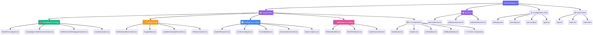

<div align="center">


[](LICENSE)
[](https://github.com/leonidas-esquire/Bookmarketing.AI/wiki)
[](https://react.dev/)
[](https://www.typescriptlang.org/)
[](https://vitejs.dev/)
[](https://ai.google.dev/)

</div>

> **Bookmarketing.AI** is your all-in-one solution for turning your manuscript into a bestseller. We provide a suite of AI-powered tools designed to handle the complexities of book marketing, from audience analysis to targeted outreach. Our platform empowers authors to focus on what they do best—writing—while our intelligent software works to connect their stories with one million readers. Your journey to becoming a bestselling author starts here.

## 📖 Documentation

For comprehensive documentation, tutorials, and guides, please visit our **[Wiki](https://github.com/leonidas-esquire/Bookmarketing.AI/wiki)**.

The wiki includes detailed information on:
- Getting started with installation and setup
- In-depth feature explanations and usage guides
- Technology stack and architecture details
- Project structure and contribution guidelines

## Key Features

**Bookmarketing.AI** leverages the power of the Google Gemini API to offer a comprehensive suite of AI-driven marketing tools. These features are designed to streamline your marketing efforts and help you connect with a global audience.

### Foundational Strategy

-   **Book DNA Analyzer** — Performs a deep analysis of your manuscript to define its core identity, target audience, and market position
-   **Campaign Architecture** — Architects detailed launch plans, long-term marketing roadmaps, and strategic budget allocations based on your book's unique DNA
-   **Multi-Channel Strategy** — Generates customized marketing plans for major platforms like Amazon, social media, email, and influencer networks
-   **Asset Generation** — Creates a complete library of ready-to-use marketing materials, including blurbs, ad copy, social media posts, and video scripts

### Creative Tools

-   **Marketing Video Creator** — Transforms your manuscript into a comprehensive video marketing campaign plan, from concept to script
-   **A/B Cover Optimizer** — Empowers you to edit your cover art and generate multiple variations for data-driven A/B testing on retail platforms
-   **Multi-Channel Audio AI** — Converts text excerpts into high-quality audio for podcasts, social media content, and audiobook samples

### Intelligence & Sales

-   **Market Intelligence AI** — Provides real-time insights into competitor positioning, emerging market trends, and reader conversations
-   **Marketability Analyzer** — Delivers data-driven feedback on your book cover's genre-fit and commercial appeal
-   **Reader Journey AI** — Architects a complete, psychology-driven sales funnel to guide potential readers from awareness to purchase
-   **Author Sales Platform** — Enables you to systematically scale your income by selling your book directly to readers through a high-converting checkout process

### Distribution & Scaling

-   **Author Hub Builder** — Integrates all your marketing channels into a high-converting, central author website
-   **Book Distributor** — Generates and sends professional ONIX metadata packages to major retailers, ensuring your book is discoverable
-   **Content Scaler AI** — Transcribes your spoken ideas into blog posts, social media updates, and newsletters to effortlessly scale your content production

## Technology Stack

This project is built with a modern, scalable technology stack:

-   **[React](https://react.dev/)** — A JavaScript library for building user interfaces
-   **[Vite](https://vitejs.dev/)** — Next-generation frontend tooling for faster development
-   **[TypeScript](https://www.typescriptlang.org/)** — Typed superset of JavaScript for enhanced code quality
-   **[Google Gemini API](https://ai.google.dev/)** — Powers AI-driven marketing features
-   **[jsPDF](https://github.com/parallax/jsPDF)** — Client-side PDF generation for marketing materials

## Project Structure

The project is organized into a clean, modular architecture that separates concerns and makes it easy to navigate:

<div align="center">

</div>

The **components** directory contains all React components, organized by their functional categories (Foundational Strategy, Creative Tools, Intelligence & Sales, Distribution & Scaling, and UI Components). The **services** directory houses the core business logic, including the Gemini API integration, PDF export functionality, and sales data management.

### Directory Structure

```
Bookmarketing.AI/
├── README.md                                    # Comprehensive project overview
├── package.json                                 # Project dependencies and scripts
├── tsconfig.json                                # TypeScript configuration
├── vite.config.ts                               # Vite build configuration
├── index.html                                   # Application entry point
├── index.tsx                                    # React application bootstrap
├── App.tsx                                      # Main application component
├── types.ts                                     # TypeScript type definitions
├── metadata.json                                # Project metadata
├── Bookmarketing_ai.png                         # Project cover image
├── project-structure.mmd                        # Mermaid diagram source
├── project-structure.png                        # Project structure visualization
│
├── components/                                  # React components
│   ├── Dashboard.tsx                            # Main dashboard component
│   ├── Header.tsx                               # Application header
│   ├── LeftSidebar.tsx                          # Navigation sidebar
│   ├── LoginScreen.tsx                          # User authentication
│   │
│   ├── BookDNAAnalyzer.tsx                      # Book analysis tool
│   ├── CampaignArchitectureGenerator.tsx        # Campaign planning
│   ├── MultiChannelStrategyGenerator.tsx        # Multi-channel marketing
│   ├── AssetGenerator.tsx                       # Marketing asset creation
│   │
│   ├── MarketingVideoCreator.tsx                # Video campaign creator
│   ├── ImageEditor.tsx                          # Cover art editor
│   ├── AudiobookSampleCreator.tsx               # Audio content generator
│   ├── VideoGenerator.tsx                       # Video generation tool
│   │
│   ├── MarketResearch.tsx                       # Market intelligence
│   ├── ContentAnalyzer.tsx                      # Content analysis
│   ├── FunnelBuilder.tsx                        # Sales funnel builder
│   ├── DirectSalesChannel.tsx                   # Direct sales platform
│   ├── SalesAnalytics.tsx                       # Sales analytics dashboard
│   │
│   ├── WebsiteBuilder.tsx                       # Author website builder
│   ├── BookDistributor.tsx                      # Book distribution tool
│   ├── AudioTranscriber.tsx                     # Audio transcription
│   │
│   ├── AddBookModal.tsx                         # Book addition modal
│   ├── ConfirmationModal.tsx                    # Confirmation dialogs
│   ├── StripeCheckoutModal.tsx                  # Payment checkout
│   ├── FileUploader.tsx                         # File upload component
│   ├── LoadingSpinner.tsx                       # Loading indicator
│   ├── ToolCard.tsx                             # Tool display card
│   ├── StatCard.tsx                             # Statistics card
│   ├── SalesChart.tsx                           # Sales chart component
│   ├── SalesSidebar.tsx                         # Sales sidebar
│   ├── PublicSalesPage.tsx                      # Public sales page
│   ├── AnalysisDisplay.tsx                      # Analysis results display
│   ├── AudienceAnalyzer.tsx                     # Audience analysis
│   ├── AudienceProfileDisplay.tsx               # Audience profile view
│   ├── FunnelDisplay.tsx                        # Funnel visualization
│   ├── VideoPlanDisplay.tsx                     # Video plan display
│   ├── GeneratorModule.tsx                      # Content generator module
│   ├── ImageGenerator.tsx                       # Image generation
│   ├── MarketingChatbot.tsx                     # Marketing chatbot
│   └── MarketingCopywriter.tsx                  # Copywriting assistant
│
└── services/                                    # Business logic services
    ├── geminiService.ts                         # Google Gemini API integration
    ├── pdfExportService.ts                      # PDF export functionality
    └── salesDataService.ts                      # Sales data management
```

## Getting Started

Follow these steps to get your local development environment set up and running.

### Prerequisites

Make sure you have [Node.js](https://nodejs.org/) installed on your system.

### Installation & Setup

1.  **Clone the repository:**

    ```bash
    git clone https://github.com/leonidas-esquire/Bookmarketing.AI.git
    cd Bookmarketing.AI
    ```

2.  **Install dependencies:**

    Use npm to install the necessary packages.

    ```bash
    npm install
    ```

3.  **Set up your environment variables:**

    Create a `.env.local` file in the root of your project and add your Gemini API key.

    ```
    GEMINI_API_KEY=your_api_key_here
    ```

4.  **Run the development server:**

    ```bash
    npm run dev
    ```

    Your application should now be running at `http://localhost:3000`.

---

**View your app in AI Studio:** https://ai.studio/apps/drive/1k6Wu0x9lfGdc8XlVPlHhiSW4FO9--DA0


## 🤝 Contributing

We welcome contributions from the community! Whether you're fixing bugs, adding new features, or improving documentation, your help is appreciated.

Please read our **[Contributing Guidelines](CONTRIBUTING.md)** to get started. Make sure to also review our **[Code of Conduct](CODE_OF_CONDUCT.md)** to understand our community standards.

## 📄 License

This project is proprietary software. All rights reserved. Please contact the repository owner for licensing inquiries.

## 🌟 Acknowledgments

-   **Powered by [Google Gemini API](https://ai.google.dev/)** — Enabling intelligent, AI-driven marketing capabilities
-   **Built with [React](https://react.dev/)** — For a modern, component-based user interface
-   **Accelerated by [Vite](https://vitejs.dev/)** — For lightning-fast development and build times

---

<div align="center">

**Made with ❤️ for authors who want to reach one million readers**

[Website](https://ai.studio/apps/drive/1k6Wu0x9lfGdc8XlVPlHhiSW4FO9--DA0) • [Documentation](https://github.com/leonidas-esquire/Bookmarketing.AI/wiki) • [Report Bug](https://github.com/leonidas-esquire/Bookmarketing.AI/issues) • [Request Feature](https://github.com/leonidas-esquire/Bookmarketing.AI/issues)

</div>
